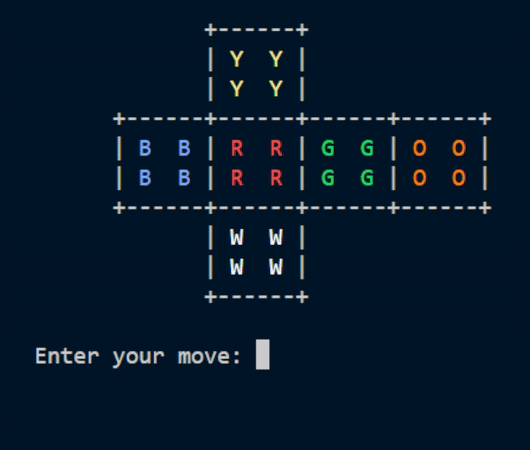

# 🧩 Rubik's Cube Solver


## 📝 Overview

This project is a **Rubik's Cube Solver** written entirely in TypeScript. Using an object oriented approach, the Solver class takes a scrambled cube as an input and solves it using my own implementation of the LBL method.

## 🚀 Features

- Cube visualization in the terminal
- You can interact with the cube in the CLI



- My implementaion of the LBL solving algorithm
- TypeScript for strong typing and maintainability

## 📂 Project Structure

```
📦 rubiks-cube-solver
├── 📁 src
│   ├── 📁 typings
│   │   ├── 🟦 cube_types.ts         # Type definitions for cube structure
│   │   ├── 🟦 int_range.ts          # Utility type for integer ranges
│   ├── 📁 utils
│   │   ├── 🟦 colors.ts             # Color-related utilities
│   │   ├── 🟦 corners.ts            # Corner mapping
│   │   ├── 🟦 validate_move.ts      # Move validation logic
│   ├── 🟦 cli.ts                   # Command-line interface logic
│   ├── 🟦 cube.ts                  # Cube representation and manipulation
│   ├── 🟦 solver.ts                # Core solving algorithm
│   ├── 🟦 index.ts                 # Entry point
├── 📄 package.json                 # Dependencies and scripts
├── 📄 tsconfig.json                # TypeScript configuration
├── 📄 README.md                    # This file
```

## 🔬 How It Works

Describe the solving algorithm here. Explain:
- How the cube state is represented.
- What method is used to solve the cube.
- Any optimizations applied.
- TODO!!!

## ⬇️ Installation

```sh
git clone https://github.com/your-username/rubiks-cube-solver.git
cd rubiks-cube-solver
npm install
```

Compile the Typescript files into JavaScript (important!):

```sh
tsc
```

## ▶️ Usage

Start the app:

```sh
npm start
```

Which is equivalent to:

```sh
node dist/index.js
```

Example usage:

Using the solving algorithm on a scrambled cube
```typescript
import { Solver } from "./solver.js";

const solver = new Solver();
solver.scramble();
solver.solve();
```

This code allows you to freely interact with the cube in the command line
```typescript
import { CliCube } from "./cli.js";

const cli = new CliCube();
cli.promptMove();
```

## 📜 License

[MIT](LICENSE)

